# Business Central Core ERD

```mermaid
erDiagram
    merchants ||--o{ user_memberships : owns
    user_identities ||--o{ user_memberships : authenticates
    user_memberships }o--o{ roles : receives
    roles }o--o{ permissions : grants
    merchants ||--o{ customers : owns
    user_identities ||--o{ customers : may_link
    customers ||--o{ customer_addresses : has
    merchants ||--o{ shops : owns
    business_types ||--o{ shops : classifies
    merchants ||--o{ locations : owns
    locations ||--o{ locations : contains
    shops ||--o{ locations : anchors
    merchants ||--o{ products : owns
    products ||--o{ product_variants : contains
    products ||--o{ catalog_product_images : displays
    product_variants ||--o{ catalog_variant_images : displays
    merchants ||--o{ suppliers : owns
    suppliers ||--o{ purchase_orders : receives
    purchase_orders ||--o{ purchase_order_lines : contains
    product_variants ||--o{ purchase_order_lines : ordered
    purchase_orders ||--o{ goods_receipts : has
    goods_receipts ||--o{ goods_receipt_lines : contains
    purchase_order_lines ||--o{ goods_receipt_lines : received
    merchants ||--o{ orders : owns
    customers ||--o{ orders : places
    orders ||--o{ order_lines : contains
    product_variants ||--o{ order_lines : sells
    orders ||--o{ payments : paid_by
    merchants ||--o{ payment_types : configures
    payment_type_categories ||--o{ payment_types : classifies
    payment_types ||--o{ payments : selected_for
    payments ||--o{ refunds : refunded_by
    orders ||--o{ fulfillments : fulfilled_by
    fulfillments ||--o{ fulfillment_lines : contains
    order_lines ||--o{ fulfillment_lines : fulfilled
    merchants ||--o{ inventory_balances : maintains
    locations ||--o{ inventory_balances : stores
    product_variants ||--o{ inventory_balances : counts
    product_variants ||--o{ inventory_movements : moves
    inventory_movements ||--o{ inventory_cost_layers : creates
    inventory_movements ||--o{ inventory_cost_allocations : consumes
    inventory_cost_layers ||--o{ inventory_cost_allocations : funds
    goods_receipt_lines ||--o{ inventory_movements : originates
    order_lines ||--o{ inventory_movements : consumes
    merchants ||--o{ accounting_events : owns
    accounting_events ||--|| journal_entries : posts
    journal_entries ||--o{ journal_lines : contains
    accounting_accounts ||--o{ journal_lines : classifies
    orders ||--o| service_orders : fulfills
    service_orders ||--o{ service_order_work_items : contains
    service_order_work_items ||--o{ service_order_items : bills
    payments ||--o{ service_work_item_payment_allocations : allocates
    service_order_work_items ||--o{ service_work_item_payment_allocations : receives
    service_orders ||--o| repair_orders : specializes
    repair_devices ||--o{ repair_orders : receives
    service_order_work_items ||--o| repair_work_item_devices : subjects
    repair_devices ||--o| repair_work_item_devices : identified_by
    shops ||--o{ repair_presets : configures
    service_order_work_items ||--o{ repair_diagnostics : scopes
    service_order_work_items ||--o{ repair_order_parts : scopes
    service_order_work_items ||--o{ repair_order_images : scopes
    service_order_work_items ||--o{ service_order_attachments : scopes
    repair_orders ||--o{ repair_diagnostics : has
    repair_orders ||--o{ repair_order_parts : uses
    repair_orders ||--o{ repair_approvals : requires
    repair_orders ||--o{ repair_warranties : grants
```

Catalog product/variant images and repair images store a browser-viewable URL
plus `source_type` (`URL`, `GOOGLE_DRIVE`, or `UPLOAD`). Repair images retain a
nullable legacy byte payload only for compatibility with already queued mobile
and offline synchronization records. Shop logos use the same URL/source fields
inside the existing `shops.address` JSON snapshot.

`merchants.pos_complexity_level` is `SIMPLE` or `COMPLEX`. It changes the
merchant workflow only: SIMPLE products still use `product_variants` as the
canonical sellable, priced, and stock-tracked record, with exactly one standard
variant created by the backend.

The ERD intentionally shows the core system of record. Channel-specific UI, shipping-provider, CRM, and vertical-service extensions can reference these aggregates without creating competing masters.

`repair_work_item_devices` stores `waiting_start_date` and `waiting_end_date`.
Waiting days and the whole-ticket waiting range are derived projections, so no
duplicate ticket-level waiting columns are stored.
